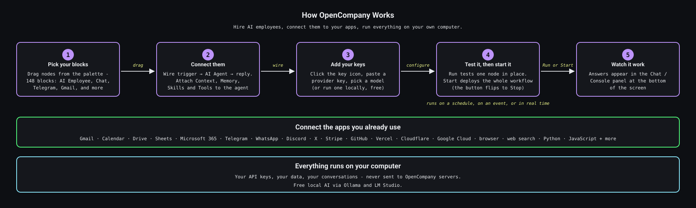
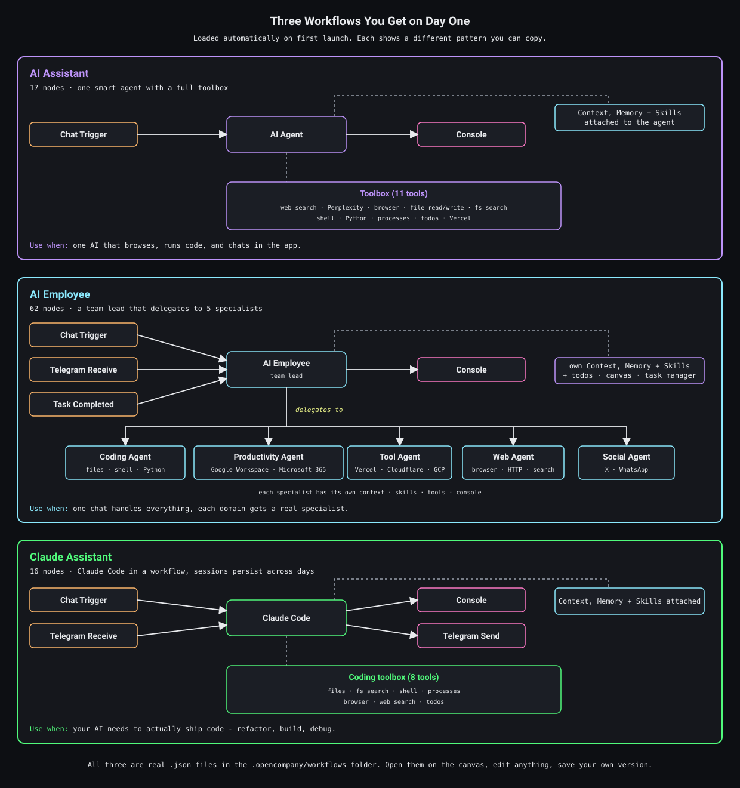

# OpenCompany

<a href="https://www.npmjs.com/package/@zeenie-ai/opencompany" target="_blank"></a>
<a href="https://opensource.org/licenses/MIT" target="_blank"></a>
<a href="https://discord.gg/c9pCJ7d8Ce" target="_blank"></a>
<a href="https://deepwiki.com/zeenie-ai/OpenCompany" target="_blank"></a>

**The self-improving operating system for AI employees.**

OpenCompany is an open-source, self-hosted OS where AI employees do knowledge work: they read and answer your mail, keep your calendar, research the web, write and ship code, run your messaging front desk, handle payments, and file what they learn. You hire them onto a canvas, equip them with tools and skills, and press Start. From then on they run as durable background workers on your own machine, and they get better at the job the longer they work.

An operating system, because it gives every employee what a worker needs from a workplace: a brain (13 model providers, cloud or local), long-term memory, a persistent working context, a skill library, 148 tools across 33 categories, teammates it can delegate to, a private workspace on disk, an encrypted credential vault, and a scheduler that keeps it alive for months across restarts and crashes.

Self-improving, because what an employee learns is kept: facts go into its memory, progress stays in its context across every firing, the tools and teammates it wires up mid-task stay on the canvas, and the skills you edit apply on the next turn. Improvement is structural, never a fine-tuned weight: everything an employee knows is visible, editable, and exportable.

No code required. No subscription. No usage limits. Bring your own API keys, or run models locally with Ollama / LM Studio for free.

**[Read the docs →](https://docs.opencompany.sh)**

## Quick Start

**Prerequisites:** Node.js 18+, Python 3.12

```bash
npm install -g @zeenie-ai/opencompany
company start
```

Open http://localhost:5678 (default `PYTHON_BACKEND_PORT`) and click the key icon (**API Credentials**) in the toolbar to connect your first AI provider. Three example workflows load on first launch; the AI Employee one is a team lead with teammates already wired.

**Prefer a desktop app?** Installers for Windows (`.exe`), macOS (`.dmg`, Apple Silicon and Intel) and Linux (`.AppImage` / `.deb`) are attached to every [GitHub Release](https://github.com/zeenie-ai/OpenCompany/releases). They need no Python or Node on the machine: the app bundles them, sets up the backend on first launch (one-time download, a minute or two), and shares its data with a CLI install in `~/.opencompany`. The first releases are unsigned, so macOS asks you to allow the app under System Settings > Privacy & Security and Windows SmartScreen needs "More info > Run anyway". Details in [docs-internal/desktop_app.md](docs-internal/desktop_app.md).

<details>
<summary><b>Run from source (for contributors)</b></summary>

```bash
git clone https://github.com/zeenie-ai/OpenCompany.git OpenCompany
cd OpenCompany
npm install -g bun
bun run build
bun run dev
```

The `dev` task starts the Vite client (with HMR) at `http://localhost:$VITE_CLIENT_PORT` — the same URL as production — proxying API/WebSocket traffic to the Python backend on `$PYTHON_BACKEND_PORT` (re-pointed in `.env.dev` so the two can coexist); optional daemons (WhatsApp, Temporal) are spawned by the backend on demand. Every port is declared in `.env.template` and overridable in `.env`; nothing is hardcoded. See [SETUP.md](docs-internal/SETUP.md) and [SCRIPTS.md](docs-internal/SCRIPTS.md) for details, and [CONTRIBUTING.md](CONTRIBUTING.md) for the codebase map and contribution recipes.

**Upgrading from MachinaOS?** Existing `~/.machina` and checkout-local `.machina` state is detected when the new `.opencompany` location does not yet exist, so databases and deployment state are not stranded. The `machina` command remains available as a deprecated legacy alias; new scripts should use `company`.

</details>

## See it in action

**Hiring your first employee, end to end ↓**

https://github.com/user-attachments/assets/a5a5583f-bb5f-4d27-a387-8522c556e89e

**An employee extending its own toolset for a complex task ↓**

https://github.com/user-attachments/assets/035a2293-0837-4969-8b9d-8d680e023b89

**A team lead coordinating specialist employees ↓**

https://github.com/user-attachments/assets/3d25e9a3-f7b9-4760-8b9a-6de1e5a19cad

## How It Works

[](https://raw.githubusercontent.com/zeenie-ai/OpenCompany/main/docs/diagrams/how-it-works.svg)

1. **Hire.** Drag an agent onto the canvas and pick its model. Twenty agent types ship, from the general-purpose AI Agent to specialists for coding, research, phone control, payments, and team leadership.
2. **Equip.** Connect tools, skills, a Memory tool, and a Context node to its input handles. Connect other agents as teammates if it should lead a team.
3. **Deploy.** Press **Run** on a node to test it in place, or press **Start** to deploy the workflow as a durable background listener that waits for email, messages, webhooks, or a schedule.
4. **Review.** Watch it work live on the canvas, read its context and memory from the node panels, accept or send back the tasks it delegates, and edit its skills when you want it to do something differently.

[](https://raw.githubusercontent.com/zeenie-ai/OpenCompany/main/docs/diagrams/default-workflows.svg)

## What an Employee Is Made Of

| Part | On the canvas | What it gives the employee |
|---|---|---|
| Brain | A model node, or the agent's provider dropdown | One of 13 providers: OpenAI, Anthropic, Google, xAI, DeepSeek, Kimi, Mistral, Groq, Cerebras, Sarvam, OpenRouter, or a local Ollama / LM Studio model |
| Memory | **Memory** tool | Durable facts, preferences, and decisions it explicitly remembers, recalls, updates, and forgets; it checks memory before answering anything about you |
| Working context | **Context** node | The conversation itself, persisted per workflow generation, so every trigger firing continues the same thread |
| Skills | **Master Skill** node or individual skill nodes | Short markdown playbooks: when to use which tool, what arguments to pass, what to avoid; 78 ship built in across 18 folders |
| Tools | Any of the 148 nodes on its `input-tools` handle | Email, calendar, documents, browser, search, code, phone, messaging, payments, cloud CLIs, local data, vision |
| Teammates | Other agents on `input-teammates` | Specialists a team lead delegates to through its built-in Task Manager |
| Workspace | `~/.opencompany/workspaces/<workflow>/` | A private directory for files, downloads, code, and dev servers, browsable from the Gallery node |
| Credentials | The encrypted vault | API keys and OAuth tokens, resolved at run time and never exposed to the model |

## How Employees Improve

- **They remember.** The Memory tool holds what an employee has chosen to keep. It is a real tool call, so you can read every entry from the node panel and correct or delete it.
- **They keep their place.** With a Context node connected, a new chat message, a completed delegated task, or a scheduled tick continues the same conversation instead of starting cold. When the context window fills, the employee compacts it into a five-section summary, including *Important Discoveries* and *Next Steps*, and carries that into the next firing.
- **They extend themselves.** The **Agent Builder** tool lets an employee inspect its own canvas mid-execution and add tools, attach skills, recruit subagents, or create whole workflows to finish the task in front of it. The tool surface is rebound live, and the new nodes stay on the canvas afterwards.
- **They take feedback.** Hire an **AI Employee** or **Orchestrator** as a team lead. It assigns bounded work to teammates through its Task Manager; every result comes back for review, and the lead accepts it, retries it, or reassigns it. Up to three tasks run in parallel, and the Team Monitor shows the whole loop.
- **You coach them.** Edit a skill in the UI and it applies on the next turn. Drop your own skills into `.opencompany/skills/` and they override the built-ins of the same name. Employees can attach existing skills to themselves through Agent Builder.

## Knowledge Work They Can Take On

- **Inbox and calendar.** Send and search Gmail; manage Calendar, Drive, Sheets, Tasks, and Contacts; **Microsoft 365** mail and calendar over the Graph API. Read any inbox over IMAP (Gmail, Outlook, Yahoo, iCloud, ProtonMail, Fastmail, or a custom server), including a polling trigger that fires on every new message.
- **The messaging front desk.** Send and receive on **WhatsApp** (personal: groups, contacts, newsletter channels), **WhatsApp Business** (official Meta Cloud API: templates, media, interactive messages, signed webhooks), **Telegram** (bots with owner detection), **Discord** (gateway message triggers, slash commands, OAuth2), and **Twitter/X**. A unified social node normalizes incoming messages so one workflow handles them all.
- **Research.** An interactive browser with accessibility-tree navigation; an alpha harness that drives your real Chrome over CDP; scraping with Crawlee, Apify actors, and TikHub's roughly 1,000-endpoint social API; search via DuckDuckGo (free), Brave, Serper, and Perplexity; residential proxies with geo-targeting and rotation.
- **Documents and a knowledge base.** Parse PDFs and HTML, chunk, embed locally or via OpenAI, store in ChromaDB / Qdrant / Pinecone, and query from any employee. Give employees typed, bounded access to workspace files and operator-approved external folders through the dataSource tool, and vision for every host model through visionAnalyze.
- **Code and shipping.** Run Python / JavaScript / TypeScript in per-workflow sandboxed workspaces, keep dev servers alive with the Process Manager node, open and merge PRs with the **GitHub** node, ship with **Vercel**, manage DNS and analytics with **Cloudflare**, and drive Compute Engine / Cloud Run / Storage with **Google Cloud**. All four authenticate through their own CLIs, no token pasting. The **Claude Code** and **Codex** agents run the vendor CLIs as long-lived sessions for serious coding work.
- **Automations.** Recurring jobs ("every weekday at 9 AM, summarize my unread email"), event-driven replies, and multi-step background pipelines. Any workflow can expose a live `/webhook/{path}` endpoint that fires on GET, POST, PUT, DELETE, or PATCH.
- **Voice and language.** Provider-abstracted text-to-speech and speech-to-text (OpenAI, ElevenLabs, Deepgram, Groq, Sarvam), with audio flowing between nodes by reference, plus translate / transliterate / detect-language nodes (DeepL, Sarvam, or any connected model).
- **Your phone.** Pair an Android phone by QR code and control it from any employee: battery and network status, app launching, WiFi / Bluetooth / airplane toggles, camera, sensors, media playback, across 16 device services.
- **Payments.** A **Stripe** action node plus a signed-webhook receiver for reacting to payment events in real time.

## The Operating System Underneath

- **A scheduler built for months, not minutes.** Workflows execute on Temporal. Deployments survive backend restarts, are never auto-terminated, and can be paused, resumed, and reset from the canvas. After a crash the OS recovers running work as paused so you consciously resume it, and a deployment whose runs keep failing pauses itself. Cron schedules backfill missed ticks within a 24-hour window, per-queue worker pools scale horizontally, and LLM steps retry transient provider errors with exponential backoff so a single rate limit never kills a long-running employee.
- **Isolated workspaces.** Every workflow gets its own directory for files, downloads, and code; path containment is enforced, and media moves between nodes as references rather than blobs.
- **A credential vault.** API keys and OAuth tokens live in a separate `credentials.db`, encrypted with Fernet (AES-128-CBC + HMAC-SHA256) under a PBKDF2-SHA256 key at 600,000 iterations. Nothing leaves your machine.
- **Cost tracking.** Memory-connected runs record provider-reported token usage and USD cost; third-party API calls are metered per operation. See spend in the API Credentials panel and edit `pricing.json` for custom pricing.
- **Login-gated by choice.** Runs open on localhost by default; switch on single-owner JWT auth or multi-user mode for shared and cloud deployments. `company deploy` provisions a login-gated VM on Google Cloud with one command.
- **Native model layer.** Every provider talks to its vendor SDK directly. Extended thinking, reasoning budgets, and reasoning effort are configured per model, and local providers report their context length automatically.

## Model Providers

### 13 providers, 12 dedicated model nodes

| Provider     | Notes                                                                    |
|--------------|--------------------------------------------------------------------------|
| OpenAI       | GPT-5.6 Sol / Terra / Luna (+ Pro variants), GPT-5.5 / 5.4, GPT-4.1      |
| Anthropic    | Claude Opus 5, Fable 5.1 / 5, Sonnet 5, Opus 4.8 / 4.7 — with extended thinking |
| Google       | Gemini 3.8 / 3.7 / 3.6 / 3.5 Flash, 3.1 Pro — with reasoning budgets     |
| xAI          | Grok 4.20, 4.20 multi-agent, 4.3 — selectable from any agent             |
| DeepSeek     | DeepSeek V4 Flash / Pro                                                  |
| Kimi         | Kimi K3                                                                  |
| Mistral      | Mistral Large / Medium / Small, Codestral                                |
| Groq         | GPT-OSS-120b and more (ultra-fast inference)                             |
| Cerebras     | GPT-OSS-120b (custom AI hardware)                                        |
| Sarvam       | Indic-first models (sarvam-105b, 128K context)                           |
| OpenRouter   | 200+ models via one unified API                                          |
| **Ollama**   | Run any local model on your machine — free, private, offline             |
| **LM Studio**| Run any local model with a desktop app — free, private, offline          |

xAI is the one provider without a standalone model node; it is chosen from the agent's own provider dropdown, which is why there are 13 providers but 12 nodes. Local providers are first-class: context length is detected from your running server, and LM Studio additionally reports vision and tool-use capability.

## Employee Types

| Agent              | Specialized for                                                          |
|--------------------|--------------------------------------------------------------------------|
| **AI Agent** / **Chat Agent** | The general-purpose employees most workflows start from      |
| **AI Employee** / **Orchestrator** | Team leads that brief, delegate to, and review other agents |
| Android Agent      | Phone control                                                            |
| Web Agent          | Browser automation, scraping, search                                     |
| Coding Agent       | Writing and running code (Python / JS / TS)                              |
| Productivity Agent | Gmail, Calendar, Drive, Sheets, Tasks, Contacts                          |
| Social Agent       | WhatsApp, Telegram, Twitter messaging                                    |
| Task Agent         | Scheduling, reminders, cron jobs                                         |
| Travel Agent       | Maps, location lookup, planning                                          |
| Payments Agent     | Stripe + financial workflows                                             |
| Consumer Agent     | Customer support, order management                                       |
| Claude Code Agent  | Anthropic's Claude Code CLI for advanced coding sessions                 |
| Codex Agent        | OpenAI Codex CLI integration                                             |
| RLM Agent          | Recursive Language Model — write code that calls itself recursively      |
| Autonomous Agent   | Code-mode loops that reduce token usage 80-98%                           |
| Tool Agent         | General-purpose tool orchestration                                       |
| Vertex Agents      | Google Vertex managed agents, plus an admin node for their lifecycle     |

The Claude Code agent keeps warm interactive sessions in a pool (same session across turns, automatic resume after a crash) and runs on interactive billing, so a Claude subscription login works instead of per-token API cost. The Codex agent sandboxes parallel tasks in git worktrees.

## The Desktop

- **12 visual themes** — light, dark, Renaissance, Greek, Edo, Steampunk, Atomic, Cyber, Wasteland, Rot, Plague, Surveillance — the ten stylized themes each ship their own icon glyphs, sound pack, and decorative ornaments. Animations honor `prefers-reduced-motion`.
- **Live execution** — nodes glow while running, employees show their iteration count, errors surface inline, and the Context and Memory panels update as the employee works.
- **Drag-to-map outputs** from one node's output directly onto another's input fields; drag files from the Gallery onto any parameter.
- **Chat + Console panel** — a resizable bottom panel with a chat pane for talking to your employees, plus Console and Terminal tabs for logs and live process output.
- **Canvas dock** — a docked display board where employees push files, screenshots, and notes for you to review.
- **Component palette** with search, categories, and a Normal/Dev mode toggle that hides infrastructure nodes until you need them.
- **4-step onboarding wizard** for first-time users, replayable any time from Settings.

## For Developers

Want to add a tool, model provider, skill, or integration? One plugin folder = one node. The backend owns every schema; the frontend renders from them automatically. No frontend code required for most extensions.

- **[CONTRIBUTING.md](CONTRIBUTING.md)** — codebase map, architecture diagrams, contribution recipes
- **[server/nodes/README.md](server/nodes/README.md)** — 5-minute plugin recipe + folder map
- **[docs-internal/](docs-internal/)** — deep-dive architecture docs (execution engine, Temporal, LLM layer, agent context, credentials, event system, performance, build pipeline)
- **[CLAUDE.md](CLAUDE.md)** — comprehensive project memory (great for AI-assisted contributions)
- **Hosted docs:** https://docs.opencompany.sh/
- **DeepWiki:** https://deepwiki.com/zeenie-ai/OpenCompany

## Contributing

Issues and pull requests are welcome. [CONTRIBUTING.md](CONTRIBUTING.md) has the fork/branch/PR workflow, the repository map, and recipes for adding a node, LLM provider, or skill.

One note on scope: connector and provider lists are kept deliberately narrow. The Apify node runs any actor through its `custom` option, the TikHub node calls any of its endpoints through `call`, and agents reach any OpenAI-compatible endpoint through the existing provider path — so a new first-class preset needs a reason beyond "my service could be in the dropdown too."

## Community

[Discord](https://discord.gg/c9pCJ7d8Ce) — the fastest way to get help, request features, and follow design discussions.

## License

[MIT](LICENSE) — © 2025 MachinaOs, © 2026 OpenCompany contributors.
