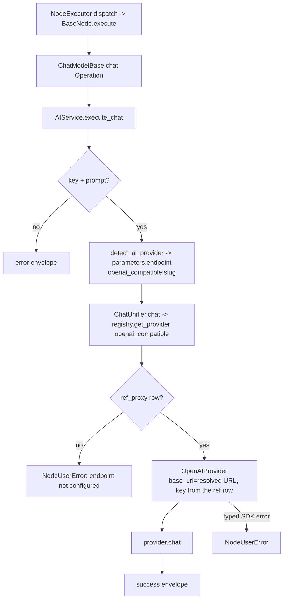

# OpenAI-compatible Chat Model (`openaiCompatibleChatModel`)

| Field | Value |
|------|-------|
| **Category** | ai_chat_models |
| **Backend handler** | [`server/nodes/model/openai_compatible_chat_model/__init__.py`](../../../server/nodes/model/openai_compatible_chat_model/__init__.py) (dispatch via `BaseNode.execute()` -> `@Operation("chat")` in [`server/nodes/model/_base.py`](../../../server/nodes/model/_base.py)) |
| **AI service** | [`server/services/ai.py::AIService.execute_chat`](../../../server/services/ai.py) |
| **Tests** | [`server/tests/nodes/test_openai_compatible_node.py`](../../../server/tests/nodes/test_openai_compatible_node.py) |
| **Skill (if any)** | n/a |
| **Dual-purpose tool** | no (group `('model',)`) |

## Purpose

Chat with any OpenAI-compatible server the user has saved as a named endpoint under Credentials > OpenAI-compatible: llama.cpp, vLLM, a LiteLLM proxy, a second Ollama host, and so on (RFC-0003 D13). The node's `endpoint` parameter holds the endpoint's provider reference, `openai_compatible:<slug>`, which `detect_ai_provider` returns as the provider. `ChatUnifier` reads the endpoint's key from the `{ref}` credential row and its resolved base URL from `{ref}_proxy`, then calls the server through `OpenAIProvider`. The `ChatModelBase.chat` operation calls `AIService.execute_chat`, as for every chat model.

## Inputs (handles)

| Handle | Connection type | Required | Purpose |
|--------|-----------------|----------|---------|
| `input-main` | main | no | Upstream data; not consumed directly |

## Parameters

| Name | Type | Default | Required | displayOptions.show | Description |
|------|------|---------|----------|---------------------|-------------|
| `endpoint` | string | `""` | yes | - | The saved endpoint, as its reference `openai_compatible:<slug>`. Options from the `openaiCompatibleEndpoints` loader; rendered first |
| `prompt` | string | `""` | yes | - | User message |
| `system_prompt` | string | `""` | no | - | System prompt |
| `model` | string | `""` (first option) | no | - | Options from the `openaiCompatibleModels` loader: the models stored when the endpoint was saved or refreshed. Reloads when `endpoint` changes. Open-world: the name is not pattern-checked |
| `temperature` | number\|null | `null` | no | - | 0-2 |
| `max_tokens` | number\|null | `null` | no | - | 1-200000. Unset: the model's registered max output (a quarter of its context, 512-4096, when only the context is known), else 2048 |
| `top_p` | number\|null | `1.0` | no | - | |
| `api_key` | string\|null | `null` (injected) | no | - | Injected from the endpoint's `{ref}` row: the key the user saved, or the placeholder `sk-no-key-required` |

The field is named `endpoint`, not `provider`, on purpose: a `provider` sibling of `model` triggers the parameter panel's stored-key effect, which would copy the endpoint's key into this node's `api_key`.

## Outputs (handles)

| Handle | Shape | Description |
|--------|-------|-------------|
| `output-model` | object | Model output; standard envelope payload |

### Output payload

```ts
{
  response: string;
  thinking: string | null;
  thinking_enabled: boolean;
  model: string;
  provider: string;          // the endpoint reference, openai_compatible:<slug>
  finish_reason: string;
  timestamp: string;
  input: { prompt: string; system_prompt: string };
}
```

Wrapped in `{ success, node_id, node_type, result, execution_time }`.

## Logic Flow



## Decision Logic

- **Provider routing**: `detect_ai_provider` recognises this node type before the `lmstudio` / `ollama` tokens and returns `parameters["endpoint"]`. With no endpoint chosen it returns the bare `openai_compatible`, which holds no key, so the run stops before any request is sent.
- **Base URL**: the URL resolved when the endpoint was saved (`services/llm/endpoints.py::resolve_base_url`); nothing is probed at call time. A call whose `{ref}_proxy` row is missing is refused instead of going to the SDK's default, api.openai.com.
- **Key**: the stored key, or the declared placeholder `sk-no-key-required` (`auth.placeholder_key` in `llm_defaults.json`); never `None`, so the SDK never falls back to `OPENAI_API_KEY`.
- **Open-world model name**: `openai_compatible` declares `open_world_models: true`, so `is_model_valid_for_provider` accepts any model id.
- **Answers without a completion**: a 2xx with no `choices` and an error body raises `LLMError(PROTOCOL)`, which names the redacted URL instead of returning an empty response.

## Side Effects

- **Database writes**: none on the chat path. Saving or refreshing the endpoint under Credentials writes the `{ref}` and `{ref}_proxy` rows and registers per-model context and price in `DATA_DIR/local_models.json`.
- **Broadcasts**: none on the chat path.
- **External API calls**: `POST {resolved base URL}/chat/completions` via the `openai` SDK.
- **File I/O**: none.
- **Subprocess**: none.

## External Dependencies

- **Credentials**: the `OpenAICompatibleCredential` rows `openai_compatible:<slug>` (key, models, per-model params) and `openai_compatible:<slug>_proxy` (resolved URL).
- **Services**: `services/llm/providers/openai.py` (`OpenAIProvider`); `services/llm/endpoints.py` (URL rooting at save time); `nodes/model/_local_validator.py` (the save path and kind detection); `nodes/model/_option_loaders.py` (the endpoint and model dropdowns).
- **Python packages**: `openai`.
- **Environment variables**: none.

## Edge cases & known limits

- **The model list is a snapshot**: it is read when the endpoint is saved or refreshed. A model the server loads later appears only after Refresh in the Credentials panel.
- **Sizing**: the kind is detected once at save time. An endpoint detected as Ollama or LM Studio is sized by their SDK probes, llama.cpp by `n_ctx` from `/props`; any other server by vLLM's `max_model_len` on the model list, then LiteLLM's model table by model id. Failing all of these the `openai_compatible` defaults apply (8192 context, 2048 output).
- **Removed endpoint**: a node that still names it has no key row, so the run fails before any request is sent. Pick another endpoint, or add it again.
- **Error boundary**: typed OpenAI SDK failures become user-safe `NodeUserError` values in `ChatUnifier`, which `BaseNode.execute()` turns into the standard failure envelope.

## Related

- **Peer nodes**: [`ollamaChatModel`](./ollamaChatModel.md) and [`lmstudioChatModel`](./lmstudioChatModel.md), which share the save path; the cloud chat-model docs in this folder.
- **Architecture docs**: [Native LLM SDK](../../native_llm_sdk.md) and [RFC-0003](../../../RFC-0003-OPENAI-COMPATIBLE-PROVIDER-CONTRACT.md).
